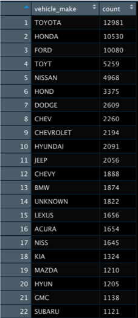
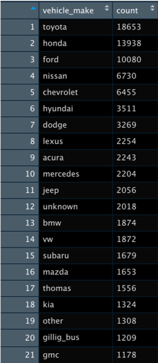

# Predicting Car Crash Culpability

## Outline of My Tasks
I was tasked with creating a predictive model built on a linear SVC framework that analyzes various driving conditions to determine driver culpability in car crashes. I managed to achieve a relatively high accuracy and precision when predicting driver fault. The initial data set was cleaned and tidied using regex and string replacement.

## Data Set Overview and Cleaning
The data set contains information on car crashes in Montgomery County, MD from 2018 to 2019. The data covers all pertinent information including driving conditions, driver awareness, and crash details.

One main issue in the data set was inconsistent vehicle make spelling. I utilized `regex` for string parsing and R's `stringr` library for replacement to consolidate all makes into their intended groupings.

*Before Cleaning*

*After Cleaning*

## Methodology
The outcome to be analyzed and predicted is the `driver_at_fault` column. As for features, since most of the columns contained categorical data I used `get_dummies` from the `pandas` Python library to encode each possible categorical outcome as binary values. I determined the best features to use with `SelectKBest` and `f_classif` from the `sklearn` library.

## Model and Results
After feature and outcome selection I fit the data to a **Linear SVC Model** with significant success.

